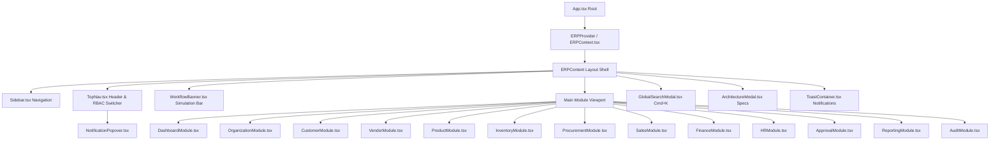
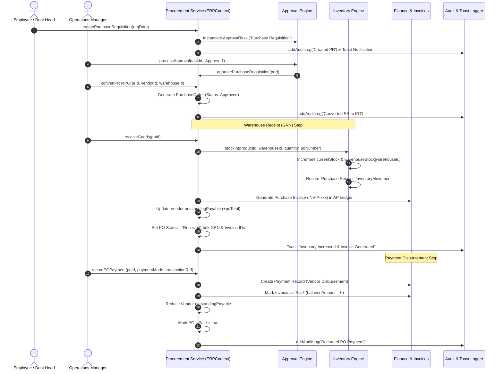
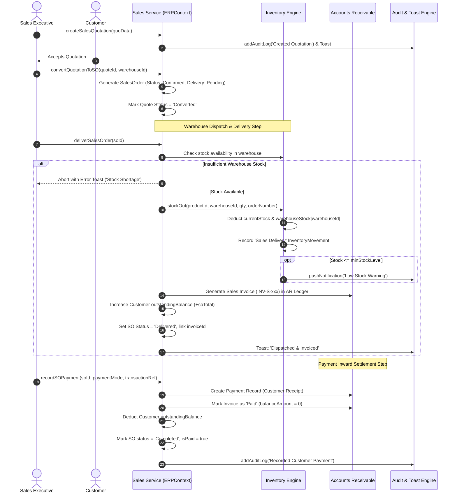
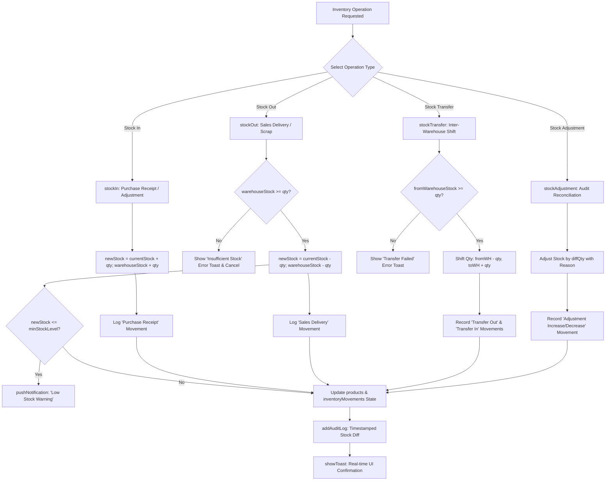
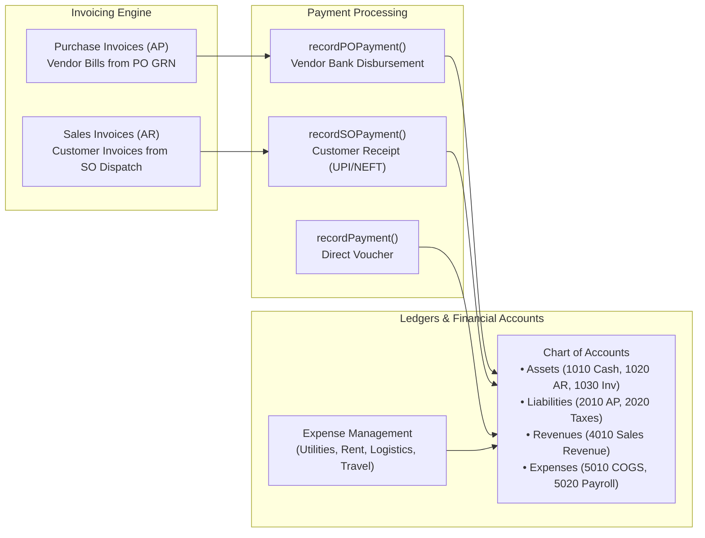
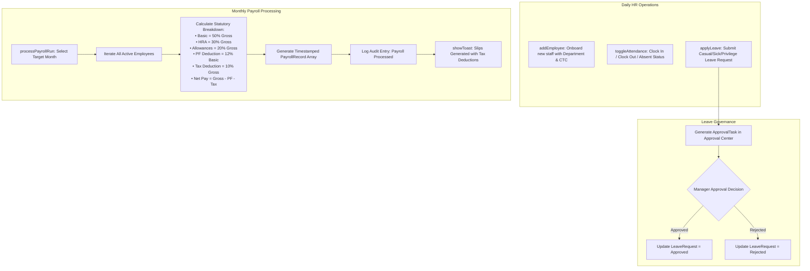
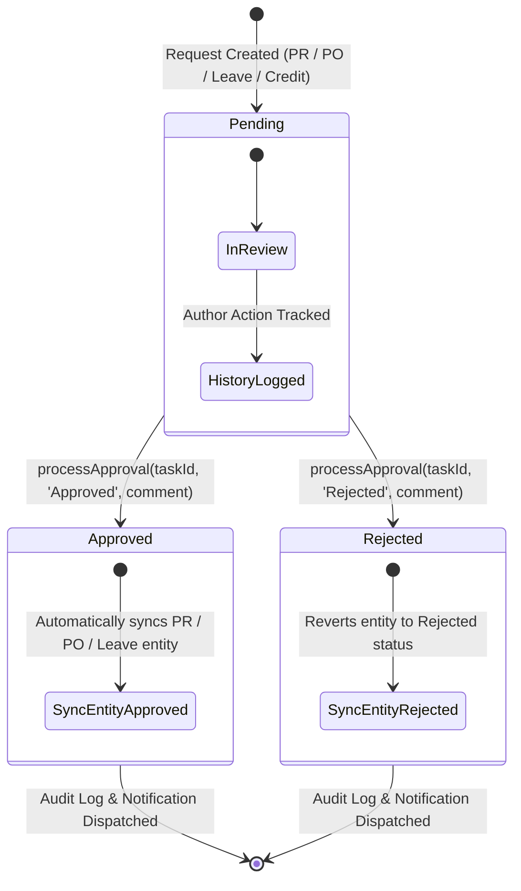
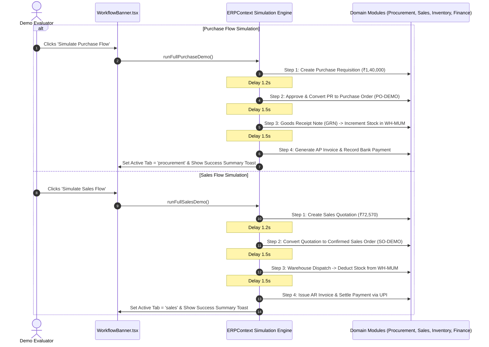
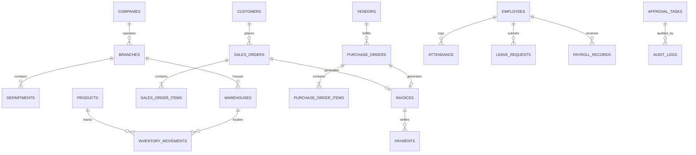

# Ganga ERP Solution — Frontend Architecture & Services Documentation

> **Scope Note:** This documentation exclusively covers the **Frontend Architecture, Component Ecosystem, State Management, and Client-Side Services**. It details all workflows, reactive data flows, and module interactions without referencing backend infrastructure.

---

## Table of Contents
1. [Executive Overview & Frontend Tech Stack](#1-executive-overview--frontend-tech-stack)
2. [Frontend Architecture & Component Hierarchy](#2-frontend-architecture--component-hierarchy)
3. [Central State Engine & Service Layer (`ERPContext`)](#3-central-state-engine--service-layer-erpcontext)
4. [End-to-End Workflow Flowcharts & Service Explanations](#4-end-to-end-workflow-flowcharts--service-explanations)
   - [4.1 Authentication & Role-Based Access Control (RBAC)](#41-authentication--role-based-access-control-rbac)
   - [4.2 Master Data Management Workflow](#42-master-data-management-workflow)
   - [4.3 Procure-to-Pay (P2P) Supply Chain Workflow](#43-procure-to-pay-p2p-supply-chain-workflow)
   - [4.4 Order-to-Cash (O2C) Sales & Delivery Workflow](#44-order-to-cash-o2c-sales--delivery-workflow)
   - [4.5 Multi-Warehouse Inventory & Movement Engine](#45-multi-warehouse-inventory--movement-engine)
   - [4.6 Financial Accounting, Invoicing & General Ledger](#46-financial-accounting-invoicing--general-ledger)
   - [4.7 Human Capital Management (HCM) & Payroll Workflow](#47-human-capital-management-hcm--payroll-workflow)
   - [4.8 Universal Multi-Stage Approval & Governance Engine](#48-universal-multi-stage-approval--governance-engine)
   - [4.9 Immutable Audit Logging & Real-Time Notification Pipeline](#49-immutable-audit-logging--real-time-notification-pipeline)
   - [4.10 Interactive Guided Simulation Engine](#410-interactive-guided-simulation-engine)
5. [Frontend Directory & File Structure](#5-frontend-directory--file-structure)
6. [Component Reference & UI Modules](#6-component-reference--ui-modules)
7. [TypeScript Domain Models & Data Contracts](#7-typescript-domain-models--data-contracts)
8. [Setup, Execution & Build Instructions](#8-setup-execution--build-instructions)
9. [Business Rules, Mathematical Formulations & Validation Logic](#9-business-rules-mathematical-formulations--validation-logic)
10. [Comprehensive `useERP` Client Service API Reference](#10-comprehensive-useerp-client-service-api-reference)
11. [Granular Role-Based Access Control (RBAC) Matrix](#11-granular-role-based-access-control-rbac-matrix)
12. [Enterprise Design System, Theming & UI Tokens](#12-enterprise-design-system-theming--ui-tokens)
13. [Full-Stack Backend Integration Blueprint & REST API Contracts](#13-full-stack-backend-integration-blueprint--rest-api-contracts)
14. [Automated Simulation Scenarios & QA Validation Playbook](#14-automated-simulation-scenarios--qa-validation-playbook)

---

## 1. Executive Overview & Frontend Tech Stack

The **Ganga ERP Solution** frontend is a high-performance Single Page Application (SPA) built with modern web technologies to emulate a comprehensive enterprise resource planning system. It implements a **reactive, decoupled client-side service layer** that manages master data, supply chain processes, financial ledgers, HR operations, and governance workflows.

### Core Frontend Stack
- **Framework & Runtime**: React 18 (TypeScript 5.7)
- **Build Tool & Dev Server**: Vite 6.1
- **Styling & Design System**: Tailwind CSS v4 (`@tailwindcss/vite`) with curated enterprise color palettes, custom gradients, and glassmorphic elevation
- **Iconography**: Lucide React (`lucide-react`)
- **Data Visualization**: Recharts (`recharts` v2.15) for executive dashboards, revenue charts, and inventory analytics
- **State Architecture**: React Context API (`ERPContext`) paired with custom hooks (`useERP`) implementing pure state immutability, synchronous audit trails, and automatic cross-module synchronization

```
┌─────────────────────────────────────────────────────────────────────────┐
│                         GANGA ERP FRONTEND APP                          │
│                                                                         │
│  ┌───────────────────────┐  ┌────────────────────────────────────────┐  │
│  │     Vite + React      │  │        Tailwind CSS v4 + Recharts      │  │
│  │ (TypeScript SPA Root) │  │       (Rich Enterprise UI & Charts)    │  │
│  └───────────┬───────────┘  └───────────────────┬────────────────────┘  │
│              │                                  │                       │
│              ▼                                  ▼                       │
│  ┌───────────────────────────────────────────────────────────────────┐  │
│  │            ERPContext & Reactive Service Engine (useERP)          │  │
│  │   • Master Data Service     • Procurement (P2P) Service           │  │
│  │   • Inventory Engine        • Sales & Delivery (O2C) Service      │  │
│  │   • Finance & Invoicing     • HR & Payroll Service                │  │
│  │   • Multi-Stage Approvals   • RBAC & Security Matrix              │  │
│  │   • Toast & Notification    • Immutable Audit Logger              │  │
│  │   • Interactive Simulation  • Global Spotlight Search Engine      │  │
│  └──────────────────────────────────┬────────────────────────────────┘  │
│                                     │                                   │
│              ┌──────────────────────┴──────────────────────┐            │
│              ▼                                             ▼            │
│  ┌───────────────────────┐                     ┌───────────────────────┐│
│  │ 13 Domain UI Modules  │                     │ Layout & Dialog System││
│  │ (Dashboard, Sales,    │                     │ (TopNav, Sidebar,     ││
│  │  Procurement, etc.)   │                     │  Modals, Toasts)      ││
│  └───────────────────────┘                     └───────────────────────┘│
└─────────────────────────────────────────────────────────────────────────┘
```

---

## 2. Frontend Architecture & Component Hierarchy

The UI follows a modular shell layout with high-cohesion sub-modules. The `App.tsx` root orchestrates the top-level layout, including the collapsible navigation sidebar, the global header navbar, interactive guided demo banners, global spotlight search, architecture inspector, and floating toast notifications.

### Frontend Component Architecture Diagram



---

## 3. Central State Engine & Service Layer (`ERPContext`)

The frontend implements `ERPContext` ([src/context/ERPContext.tsx](file:///c:/Users/Krushil/Downloads/enterprise-erp-solution-%E2%80%93-demo-_-poc/src/context/ERPContext.tsx)), which serves as the **unified client-side micro-kernel**. It encapsulates all business logic, relational integrity validations, domain mutations, and inter-service side-effects.

### State & Service Contracts Summary

| Service Domain | Managed State Entities | Key Frontend Methods / Handlers |
| :--- | :--- | :--- |
| **Auth & RBAC** | `currentUser`, `isLoggedIn` | `login()`, `logout()`, `hasPermission(module)` |
| **Organization** | `company`, `branches`, `departments`, `warehouses` | Master read-only state & branch filtering |
| **Master Data** | `customers`, `vendors`, `products` | `addCustomer()`, `updateCustomer()`, `addVendor()`, `updateVendor()`, `addProduct()`, `updateProduct()` |
| **Inventory Engine** | `inventoryMovements`, warehouse stock allocations | `stockIn()`, `stockOut()`, `stockTransfer()`, `stockAdjustment()` |
| **Procurement (P2P)** | `purchaseRequisitions`, `purchaseOrders` | `createPurchaseRequisition()`, `approvePurchaseRequisition()`, `rejectPurchaseRequisition()`, `convertPRToPO()`, `createPurchaseOrder()`, `approvePurchaseOrder()`, `receiveGoods()`, `recordPOPayment()` |
| **Sales (O2C)** | `salesQuotations`, `salesOrders` | `createSalesQuotation()`, `convertQuotationToSO()`, `createSalesOrder()`, `confirmSalesOrder()`, `deliverSalesOrder()`, `recordSOPayment()` |
| **Finance & Billing** | `invoices`, `payments`, `expenses`, `chartOfAccounts` | `recordInvoicePayment()`, `recordPayment()`, `addExpense()` |
| **HR & Workforce** | `employees`, `attendance`, `leaveRequests`, `payrollRecords` | `addEmployee()`, `toggleAttendance()`, `applyLeave()`, `processPayrollRun()` |
| **Approval System** | `approvalTasks`, `approvalRequests` | `processApproval()`, `approveRequest()`, `rejectRequest()` |
| **Audit & Alerts** | `auditLogs`, `notifications`, `toasts` | `addAuditLog()`, `pushNotification()`, `markNotificationAsRead()`, `markAllNotificationsAsRead()`, `showToast()`, `removeToast()` |
| **Simulation Engine** | `isSimulating` | `runFullPurchaseDemo()`, `runFullSalesDemo()`, `resetAllDemoData()` |

---

## 4. End-to-End Workflow Flowcharts & Service Explanations

### 4.1 Authentication & Role-Based Access Control (RBAC)

The frontend features a client-side RBAC engine supporting 5 predefined corporate roles: `ADMIN`, `MANAGER`, `FINANCE`, `HR`, and `EMPLOYEE`. Switching roles dynamically recalculates accessible sidebar navigation items, action buttons, and approval authorities.

#### RBAC Authorization Flowchart

```mermaid
flowchart TD
    Start([User Selects Role in TopNav]) --> LoginCall[login(role) Triggered]
    LoginCall --> UpdateUser[Update currentUser State in ERPContext]
    LoginCall --> AuditLogin[Write AuditLog: 'User Login']
    LoginCall --> TriggerToast[Show Toast: 'Switched active session']
    UpdateUser --> EvalPerms[Evaluate hasPermission(module)]

    EvalPerms --> CheckAdmin{Role == ADMIN?}
    CheckAdmin -- Yes --> FullAccess[Full Access to all 16 Navigation Tabs]
    CheckAdmin -- No --> CheckRole{Role Check}

    CheckRole -- MANAGER --> MgrTabs[Dashboard, Masters, Supply Chain, Approvals, Reports, Audit]
    CheckRole -- FINANCE --> FinTabs[Dashboard, Invoices, Financial Ledgers, Reports, Sales/PO Read]
    CheckRole -- HR --> HRTabs[Dashboard, HR & Workforce, Leave Approvals, Payroll]
    CheckRole -- EMPLOYEE --> EmpTabs[Dashboard, Self-Requisition, Sales Orders, Catalog View]

    FullAccess --> RenderNav[Sidebar & TopNav Render Permitted Modules]
    MgrTabs --> RenderNav
    FinTabs --> RenderNav
    HRTabs --> RenderNav
    EmpTabs --> RenderNav
```

---

### 4.2 Master Data Management Workflow

Master records (Customers, Vendors, and Products) maintain consistent identification codes, GSTIN tax identifiers, address directories, and ledger states. Adding or updating a master entity automatically records a timestamped audit entry and shows UI feedback.

#### Master Data Registration Flow

```mermaid
flowchart TD
    UserAction[User Submits Form in Customer / Vendor / Product Module] --> Validate[Client-Side Form Validation]
    Validate --> DispatchMethod{Selected Master Entity}

    DispatchMethod -- Customer --> AddCust[addCustomer(custData)]
    AddCust --> GenCustId[Generate CUS-ID, Balance=0]
    AddCust --> UpdateCustState[Append to customers Array]

    DispatchMethod -- Vendor --> AddVend[addVendor(venData)]
    AddVend --> GenVendId[Generate VEN-ID, Payable=0]
    AddVend --> UpdateVendState[Append to vendors Array]

    DispatchMethod -- Product --> AddProd[addProduct(prodData, warehouseId, qty)]
    AddProd --> GenProdId[Generate PROD-ID, Initialize Warehouse Stock Matrix]
    AddProd --> UpdateProdState[Append to products Array]
    AddProd --> StockInit{Initial Qty > 0?}
    StockInit -- Yes --> GenMovement[Generate 'Adjustment Increase' InventoryMovement]
    StockInit -- No --> AuditStep

    UpdateCustState --> AuditStep[addAuditLog('Created Entity', Module, RecordId)]
    UpdateVendState --> AuditStep
    GenMovement --> AuditStep

    AuditStep --> ToastFeedback[showToast('success', Entity Registered)]
```

---

### 4.3 Procure-to-Pay (P2P) Supply Chain Workflow

The Procure-to-Pay cycle is a multi-step reactive workflow that transitions from an internal requisition to warehouse goods receipt, automatic stock augmentation, accounts payable invoice generation, and bank payment disbursement.

#### Procure-to-Pay (P2P) Reactive Flowchart



#### Step-by-Step Frontend P2P Service Methods:
1. `createPurchaseRequisition(reqData)`: Creates a new requisition with auto-generated ID `PR-2025-XXX`, queues a pending `ApprovalTask`, triggers a high-priority notification for managers, and logs an audit trail.
2. `approvePurchaseRequisition(id, comment)`: Updates PR status to `Approved` and updates the approval history.
3. `convertPRToPO(prId, vendorId, warehouseId)`: Computes itemized GST rates, creates an approved `PurchaseOrder` (`PO-2025-XXX`), and links the PR to the PO.
4. `receiveGoods(poId)`:
   - Evaluates PO items and invokes `stockIn()` for each item at the designated warehouse.
   - Updates product stock counters and registers `InventoryMovement` entries.
   - Instantiates a **Purchase Invoice** (`INV-P-2025-XXX`) under Accounts Payable with 30-day payment terms.
   - Increases the vendor's `outstandingPayable` balance.
5. `recordPOPayment(poId, paymentMode, transactionRef)`: Creates a payment voucher, closes the invoice balance, reconciles the vendor account, and marks `po.isPaid = true`.

---

### 4.4 Order-to-Cash (O2C) Sales & Delivery Workflow

The Order-to-Cash cycle manages quotations, sales order confirmation, stock level validation, automatic warehouse dispatch, inventory deduction, accounts receivable invoice generation, and customer payment receipt.

#### Order-to-Cash (O2C) Reactive Flowchart



#### Step-by-Step Frontend O2C Service Methods:
1. `createSalesQuotation(quoData)`: Generates formal quote `QUO-2025-XXX` with discounts and tax computations.
2. `convertQuotationToSO(quoteId, warehouseId)`: Translates quotation items into a confirmed `SalesOrder` (`SO-2025-XXX`) and marks the quote as converted.
3. `createSalesOrder(soData)`: Directly creates a sales order, raises a real-time order alert, and registers audit logs.
4. `deliverSalesOrder(soId)`:
   - Validates that target warehouse stock is strictly $\ge$ required quantity for all line items.
   - Calls `stockOut()` to deduct quantities from the specific warehouse.
   - Emits a low-stock alert if inventory falls below `minStockLevel`.
   - Generates a **Sales Invoice** (`INV-S-2025-XXX`) under Accounts Receivable.
   - Updates the customer's `outstandingBalance`.
5. `recordSOPayment(soId, paymentMode, transactionRef)`: Registers incoming funds (NEFT, UPI, Cheque), reconciles the customer invoice, reduces outstanding AR balance, and marks the sales order as `Completed`.

---

### 4.5 Multi-Warehouse Inventory & Movement Engine

The inventory service tracks SKU-level stock across 3 regional distribution hubs (`WH-MUM` Mumbai, `WH-AHM` Ahmedabad, `WH-BLR` Bangalore Tech Hub). Every stock change is written into an immutable `inventoryMovements` ledger.

#### Inventory Movement & Transfer Flowchart



---

### 4.6 Financial Accounting, Invoicing & General Ledger

The finance service provides unified Accounts Receivable (AR) and Accounts Payable (AP) management, statutory GST calculation (CGST/SGST/IGST breakdown), General Ledger Chart of Accounts, and expense tracking.

#### Financial Flow & Double-Entry Ledger Representation



---

### 4.7 Human Capital Management (HCM) & Payroll Workflow

The HR service manages employee master profiles, daily attendance check-in/out toggling, leave requests with managerial approvals, and one-click end-of-month payroll generation.

#### HCM & Payroll Process Flowchart



---

### 4.8 Universal Multi-Stage Approval & Governance Engine

A centralized approval workflow handles requests across multiple domains (Purchase Requisitions, Purchase Orders, Employee Leave Applications, and Customer Credit Extensions).

#### Approval Engine State Machine



---

### 4.9 Immutable Audit Logging & Real-Time Notification Pipeline

Every mutating action in the system is synchronously recorded to `auditLogs` with the operator's ID, role, target module, record reference, before/after values, and IP simulation.

```mermaid
flowchart TD
    UserAction[Any Frontend Mutation: Create / Update / Approve / Pay] --> DispatchAudit[addAuditLog(action, module, recordId, prevVal, newVal)]
    DispatchAudit --> CreateEntry["Format Entry:<br/>• AUD-ID<br/>• Timestamp<br/>• User Name & Role<br/>• Module & Entity ID<br/>• Diff (Previous vs New Value)"]
    CreateEntry --> PrependAudit[Prepend to auditLogs State Array]

    UserAction --> CheckAlertCondition{Triggers Alert?}
    CheckAlertCondition -- Low Stock / New Order / Pending Approval --> PushNotif[pushNotification(title, msg, type, module)]
    PushNotif --> IncBadge[Increment unreadNotificationCount]
    PushNotif --> Popover[Display in TopNav NotificationPopover]

    UserAction --> ToastDispatch[showToast(type, title, message)]
    ToastDispatch --> AutoDismiss[Render in ToastContainer with 4.5s Auto-Dismiss]
```

---

### 4.10 Interactive Guided Simulation Engine

The frontend includes automated end-to-end scenario runners (`runFullPurchaseDemo` and `runFullSalesDemo`) in `WorkflowBanner.tsx` and `ERPContext.tsx`. These runners demonstrate asynchronous cross-module reactivity using simulated delays.

#### Simulation Runner Sequences



---

## 5. Frontend Directory & File Structure

```
enterprise-erp-solution/
├── index.html                     # HTML5 entry shell with Google Fonts
├── package.json                   # React 18, Vite, Tailwind CSS, Recharts, Lucide
├── tsconfig.json                  # TypeScript compiler options
├── vite.config.ts                 # Vite bundler & Tailwind v4 plugin configuration
└── src/
    ├── main.tsx                   # React root mount (createRoot)
    ├── App.tsx                    # Main layout shell & module switcher
    ├── index.css                  # Global Tailwind CSS v4 directives & scrollbars
    │
    ├── types/
    │   └── erp.ts                 # Strict TypeScript data models & domain types
    │
    ├── data/
    │   └── mockData.ts            # Rich initial state (Companies, Customers, Warehouses)
    │
    ├── context/
    │   └── ERPContext.tsx         # Central state store & client service methods (2000+ LOC)
    │
    └── components/
        ├── auth/
        │   └── LoginPage.tsx      # Standalone enterprise authentication & role selector
        │
        ├── common/
        │   ├── ArchitectureModal.tsx   # Interactive technical architecture inspector
        │   ├── GlobalSearchModal.tsx   # Global spotlight search dialog (Ctrl+K)
        │   ├── InboxERPLogo.tsx        # Branded enterprise SVG vector logo
        │   ├── Modal.tsx               # Reusable accessible dialog modal with backdrop
        │   ├── NotificationPopover.tsx # Real-time alerts drop-down popover
        │   ├── StatusBadge.tsx         # Color-coded badge for status indicators
        │   └── ToastContainer.tsx      # Floating toast notifications stack
        │
        ├── layout/
        │   ├── Sidebar.tsx             # Collapsible hierarchical navigation sidebar
        │   ├── TopNav.tsx              # Top bar with branch selector, search & RBAC switcher
        │   └── WorkflowBanner.tsx      # Interactive guided demo & simulation trigger bar
        │
        └── modules/
            ├── DashboardModule.tsx     # Executive metrics, KPI cards & Recharts graphs
            ├── OrganizationModule.tsx  # Company legal details, branches & department trees
            ├── CustomerModule.tsx      # Customer accounts, credit limits & aging balances
            ├── VendorModule.tsx        # Supplier onboarding, ratings & payable ledgers
            ├── ProductModule.tsx       # SKU catalog, multi-warehouse stock allocations
            ├── InventoryModule.tsx     # Stock movements, inter-warehouse transfers & audits
            ├── ProcurementModule.tsx   # PR creation, PO issuance, GRN receipts & payments
            ├── SalesModule.tsx         # Quotations, Sales Orders, warehouse dispatch & billing
            ├── FinanceModule.tsx       # Invoices, cash payments, expense ledger & Chart of Accounts
            ├── HRModule.tsx            # Employee directory, attendance clock, leaves & payroll
            ├── ApprovalModule.tsx      # Multi-level approval inbox & historical audit logs
            ├── ReportingModule.tsx     # Business intelligence reports & CSV/Print exports
            └── AuditModule.tsx         # Immutable forensic audit trail with search & filtering
```

---

## 6. Component Reference & UI Modules

### 6.1 Layout Components
- **`Sidebar.tsx`**: Renders categorised navigation groups (*Overview*, *Master Data*, *Supply Chain & Sales*, *Finance & Accounts*, *People & Governance*, *System*). Includes live counter badges for pending approvals and low-stock alerts.
- **`TopNav.tsx`**: Sticky enterprise header containing branch switcher (`WH-MUM`, `WH-AHM`, `WH-BLR`), spotlight search shortcut (`Ctrl+K`), role profile switcher, notification badge popover, and architecture viewer toggle.
- **`WorkflowBanner.tsx`**: Interactive bar providing one-click simulation triggers with progress indicators and reset controls.

### 6.2 Common UI Components
- **`GlobalSearchModal.tsx`**: Quick-search dialog indexing customers, vendors, products, POs, SOs, invoices, and employees with direct navigation.
- **`ArchitectureModal.tsx`**: Comprehensive technical modal detailing modular architecture, entity relationships, and client-side data flows.
- **`StatusBadge.tsx`**: Standardized color-coded visual indicator supporting statuses across PO, SO, Invoices, Stock, and Approvals.
- **`ToastContainer.tsx`**: High-priority alert stack rendering self-dismissing feedback messages for all actions.

### 6.3 Domain Feature Modules
1. **`DashboardModule`**: Executive dashboard featuring top KPI cards (Total Revenue, Monthly PO Spend, Active Inventory Valuation, Net Receivables), interactive Recharts revenue/spend charts, recent order tables, and quick action shortcuts.
2. **`OrganizationModule`**: Company legal entity master (CIN, GSTIN, fiscal year), multi-branch directory, department cost centers, and warehouse capacity visualizers.
3. **`CustomerModule`**: Customer directory with credit limits, payment terms (Net 15/30/60), outstanding AR tracking, and new customer modal.
4. **`VendorModule`**: Vendor ratings, GSTIN compliance, procurement terms, outstanding AP balances, and onboarding modal.
5. **`ProductModule`**: SKU catalog with tax rates (GST 5/12/18/28%), unit pricing, minimum threshold triggers, and warehouse-level stock distribution.
6. **`InventoryModule`**: Real-time stock inspector across warehouses, inter-warehouse stock transfer wizard, inventory adjustment modal, and movement ledger.
7. **`ProcurementModule`**: Purchase Requisition (PR) management, Purchase Order (PO) processing, Goods Receipt Note (GRN) generation, and vendor payment disbursement.
8. **`SalesModule`**: Sales Quotation builder, Sales Order confirmation, warehouse dispatch with stock validation, delivery execution, and customer payment recording.
9. **`FinanceModule`**: Comprehensive Accounts Receivable and Accounts Payable invoice registry, payment voucher journal, expense tracker, and 10-account General Ledger.
10. **`HRModule`**: Employee records, live attendance clock-in toggling, leave request management, and one-click payroll generator.
11. **`ApprovalModule`**: Multi-domain approval dashboard with approval/rejection decision modals and complete audit trail.
12. **`ReportingModule`**: Financial P&L summaries, inventory turnover analytics, sales performance breakdowns, and printable reports.
13. **`AuditModule`**: Immutable audit log viewer with search and filtering by module, user role, and action type.

---

## 7. TypeScript Domain Models & Data Contracts

All data structures are strictly typed in `src/types/erp.ts` to ensure end-to-end type safety:

```typescript
// Role-Based Access Control
export type UserRole = 'ADMIN' | 'MANAGER' | 'EMPLOYEE' | 'FINANCE' | 'HR';

// Organization Master
export interface Company { id: string; name: string; legalName: string; taxId: string; currency: string; }
export interface Branch { id: string; name: string; code: string; city: string; isHeadquarters: boolean; }
export interface Warehouse { id: string; name: string; code: string; branchId: string; capacitySqFt: number; utilizedPercentage: number; }

// Masters
export interface Customer { id: string; name: string; companyName: string; gstNumber: string; creditLimit: number; outstandingBalance: number; status: 'Active'|'Inactive'|'On Hold'; }
export interface Vendor { id: string; name: string; companyName: string; gstNumber: string; outstandingPayable: number; rating: number; status: 'Active'|'Under Review'|'Blacklisted'; }
export interface Product { id: string; name: string; sku: string; category: string; purchasePrice: number; sellingPrice: number; taxRate: number; minStockLevel: number; currentStock: number; warehouseStock: Record<string, number>; }

// Operations & Supply Chain
export interface PurchaseOrder { id: string; poNumber: string; vendorId: string; vendorName: string; warehouseId: string; items: PurchaseOrderItem[]; totalAmount: number; status: POStatus; goodsReceiptId?: string; invoiceId?: string; isPaid?: boolean; }
export interface SalesOrder { id: string; orderNumber: string; customerId: string; customerName: string; warehouseId: string; items: SalesOrderItem[]; totalAmount: number; status: SOStatus; deliveryStatus: 'Pending'|'Dispatched'|'Delivered'; invoiceId?: string; isPaid?: boolean; }
export interface InventoryMovement { id: string; date: string; productId: string; sku: string; type: string; warehouseId: string; quantity: number; previousStock: number; newStock: number; referenceDocId: string; performedBy: string; }

// Finance & Governance
export interface Invoice { id: string; invoiceNumber: string; type: 'Sales'|'Purchase'; referenceId: string; partyName: string; totalAmount: number; paidAmount: number; balanceAmount: number; status: InvoiceStatus; }
export interface ApprovalTask { id: string; type: string; referenceId: string; referenceNumber: string; requestedBy: string; amount?: number; status: 'Pending'|'Approved'|'Rejected'; history: Array<{ user: string; action: string; date: string; comment?: string }>; }
export interface AuditLog { id: string; userId: string; userName: string; userRole: UserRole; action: string; module: string; recordId: string; timestamp: string; previousValue?: string; newValue?: string; }
```

---

## 8. Setup, Execution & Build Instructions

### Prerequisites
- **Node.js**: v18.0.0 or higher
- **npm** (or **bun** / **yarn** / **pnpm**)

### Development Setup
```bash
# 1. Install frontend dependencies
npm install

# 2. Start Vite local development server
npm run dev
```
The application will launch locally at `http://localhost:5173/`.

### Production Build & Type Check
```bash
# 1. Perform static type validation
npm run lint

# 2. Compile optimized production assets
npm run build

# 3. Preview production build locally
npm run preview
```
All production bundle output is generated into the `dist/` directory as static HTML, CSS, and JS assets ready for CDN or static hosting deployment.

---

## 9. Business Rules, Mathematical Formulations & Validation Logic

The ERP frontend incorporates comprehensive enterprise business rules and deterministic mathematical models to validate state changes before mutating the reactive store:

### 9.1 Multi-Slab GST Tax Calculation Engine
Every commercial line item in Purchase and Sales workflows calculates statutory taxes dynamically:

$$\text{LineSubtotal} = \text{Quantity} \times \text{UnitPrice} \times \left(1 - \frac{\text{Discount \%}}{100}\right)$$

$$\text{LineTaxAmount} = \text{LineSubtotal} \times \left(\frac{\text{GST Rate \%}}{100}\right)$$

$$\text{OrderTotal} = \sum_{i=1}^{n} \text{LineSubtotal}_i + \sum_{i=1}^{n} \text{LineTaxAmount}_i$$

- **Intra-State Transactions (Same State)**: Split into equal halves: $\text{CGST} = 50\% \times \text{LineTaxAmount}$, $\text{SGST} = 50\% \times \text{LineTaxAmount}$.
- **Inter-State Transactions (Different State)**: Allocated entirely to $\text{IGST} = 100\% \times \text{LineTaxAmount}$.
- **Standard GST Slabs Supported**:
  - `5%`: Essential office consumables & raw materials.
  - `12%`: Standard electronics & computer accessories.
  - `18%`: Core IT infrastructure, network switches, and commercial software licenses.
  - `28%`: High-end enterprise servers and capital equipment.

### 9.2 Multi-Warehouse Stock Allocation & Reservation Invariants
For any product SKU $p$ across the set of active warehouses $W = \{\text{WH-MUM}, \text{WH-AHM}, \text{WH-BLR}\}$:

1. **Global Aggregate Equality**:
   $$\text{currentStock}_p = \sum_{w \in W} \text{warehouseStock}_p[w]$$
2. **Strict Non-Negative Warehouse Allocation**:
   $$\forall w \in W, \quad \text{warehouseStock}_p[w] \ge 0$$
3. **Dispatch Availability Guard**:
   $$\text{AvailableStock}_{p, w} = \text{warehouseStock}_p[w] - \text{ReservedStock}_{p, w}$$
   If requested dispatch quantity $Q > \text{AvailableStock}_{p, w}$, the client service aborts execution, throws an error notification, and prevents negative inventory drift.
4. **Automated Reorder Trigger**:
   $$\text{currentStock}_p \le \text{minStockLevel}_p \implies \text{Emit Low-Stock Notification} \land \text{Trigger Sidebar Alert Badge}$$

### 9.3 Customer Credit Limit & Payment Terms Engine
To protect company liquidity, customer order placement evaluates outstanding exposure against approved credit terms:

1. **Exposure Calculation**:
   $$\text{TotalExposure} = \text{outstandingBalance} + \text{newOrderTotal}$$
2. **Credit Ceiling Rule**:
   $$\text{TotalExposure} > \text{creditLimit} \implies \text{Flag Order as 'Credit Approval Required'}$$
3. **Maturity / Due Date Determinism**:
   $$\text{DueDate} = \text{InvoiceDate} + \Delta_{\text{terms}}$$
   - `Immediate`: $\Delta_{\text{terms}} = 0\text{ days}$
   - `Net 15`: $\Delta_{\text{terms}} = 15\text{ days}$
   - `Net 30`: $\Delta_{\text{terms}} = 30\text{ days}$
   - `Net 45`: $\Delta_{\text{terms}} = 45\text{ days}$
   - `Net 60`: $\Delta_{\text{terms}} = 60\text{ days}$

### 9.4 Statutory Payroll & CTC Decomposition Model
When executing the monthly payroll cycle (`processPayrollRun`), the engine computes statutory compensation and withholding structures for each active employee:

```
┌────────────────────────────────────────────────────────────────────────┐
│                        GROSS MONTHLY SALARY (100%)                     │
├────────────────────────┬───────────────────────┬───────────────────────┤
│    Basic Salary (50%)  │       HRA (30%)       │   Allowances (20%)    │
└───────────┬────────────┴───────────────────────┴───────────┬───────────┘
            │                                                │
            ▼                                                ▼
 ┌──────────────────────┐                         ┌──────────────────────┐
 │   PF Deduction (12%) │                         │   TDS Deduction (10%)│
 │ (12% of Basic Salary)│                         │  (10% of Gross CTC)  │
 └──────────┬───────────┘                         └──────────┬───────────┘
            │                                                │
            └───────────────────────┬────────────────────────┘
                                    │
                                    ▼
                         ┌──────────────────────┐
                         │   NET PAYOUT VALUE   │
                         │ Gross - (PF + TDS)   │
                         └──────────────────────┘
```

- $\text{Basic Salary} = 0.50 \times \text{GrossSalary}$
- $\text{House Rent Allowance (HRA)} = 0.30 \times \text{GrossSalary}$
- $\text{Special Allowances} = 0.20 \times \text{GrossSalary}$
- $\text{Provident Fund (PF Deduction)} = 0.12 \times \text{Basic Salary} = 0.06 \times \text{GrossSalary}$
- $\text{Tax Deducted at Source (TDS)} = 0.10 \times \text{GrossSalary}$
- $\text{Net Take-Home Salary} = \text{GrossSalary} - (\text{PF Deduction} + \text{TDS}) = 0.84 \times \text{GrossSalary}$

---

## 10. Comprehensive `useERP` Client Service API Reference

The `ERPContext` exposes a unified client API accessible from any component via `const erp = useERP();`. Below is the complete interface reference for all domain methods:

### 10.1 Authentication & Session Management
- **`login(roleOrEmail?: UserRole | string, password?: string): void`**
  - *Description*: Authenticates a user session, updates `currentUser`, recalculates RBAC permissions, creates an audit log entry, and emits a success toast.
- **`logout(): void`**
  - *Description*: Resets user session to unauthenticated state, redirects viewport to `LoginPage`, and clears transient notification state.
- **`hasPermission(module: ERPNavModule): boolean`**
  - *Description*: Evaluates whether the current active role possesses read/execute privileges for the specified navigation tab.
- **`setTheme(theme: 'light' | 'dark'): void`** / **`toggleTheme(): void`**
  - *Description*: Updates UI visual theme with dark/light mode class binding on `<html>` root.

### 10.2 Master Data Management
- **`addCustomer(cust: Omit<Customer, 'id' | 'createdAt' | 'outstandingBalance'>): void`**
  - *Description*: Instantiates customer record with auto-generated ID (`CUS-2025-XXX`), zero balance, logs audit trail, and shows success toast.
- **`updateCustomer(id: string, updates: Partial<Customer>): void`**
  - *Description*: Applies partial patch to existing customer entity and logs difference in audit trail.
- **`addVendor(ven: Omit<Vendor, 'id' | 'createdAt' | 'outstandingPayable'>): void`**
  - *Description*: Registers new supplier with default `Active` rating and auto-generated ID (`VEN-2025-XXX`).
- **`updateVendor(id: string, updates: Partial<Vendor>): void`**
  - *Description*: Updates vendor contact, rating, or payment term details.
- **`addProduct(prod: Omit<Product, 'id' | 'createdAt' | 'currentStock' | 'reservedStock' | 'warehouseStock'>, initialWarehouseId: string, initialQty: number): void`**
  - *Description*: Creates SKU item, initializes multi-warehouse stock map, assigns initial quantity to designated warehouse, and generates an initial inventory movement record if quantity $> 0$.
- **`updateProduct(id: string, updates: Partial<Product>): void`**
  - *Description*: Updates catalog pricing, tax rates, or threshold values.

### 10.3 Inventory Engine Methods
- **`stockIn(productId: string, warehouseId: string, quantity: number, reference: string, notes?: string): void`**
  - *Description*: Increments total stock and warehouse-specific allocation. Emits `'Purchase Receipt'` or `'Adjustment Increase'` ledger record.
- **`stockOut(productId: string, warehouseId: string, quantity: number, reference: string, notes?: string): boolean`**
  - *Description*: Verifies availability, decrements stock counters, checks low-stock thresholds, logs `'Sales Delivery'` movement, and returns `true` (or `false` on shortage).
- **`stockTransfer(productId: string, fromWarehouseId: string, toWarehouseId: string, quantity: number, notes?: string): boolean`**
  - *Description*: Safely shifts stock between two warehouses atomically. Generates paired `'Transfer Out'` and `'Transfer In'` ledger entries.
- **`stockAdjustment(productId: string, warehouseId: string, diffQuantity: number, reason: string): void`**
  - *Description*: Reconciles physical stock discrepancy post-cycle count. Adjusts warehouse stock up or down and documents reason.

### 10.4 Procure-to-Pay (P2P) Flow Methods
- **`createPurchaseRequisition(req: Omit<PurchaseRequisition, 'id' | 'reqNumber' | 'status'>): void`**
  - *Description*: Creates PR (`PR-2025-XXX`), places an approval task in the manager queue, and pushes notification.
- **`approvePurchaseRequisition(id: string, comment?: string): void`**
  - *Description*: Approves requisition and closes linked approval task.
- **`rejectPurchaseRequisition(id: string, comment?: string): void`**
  - *Description*: Rejects requisition with reviewer feedback.
- **`convertPRToPO(prId: string, vendorId: string, warehouseId: string): string`**
  - *Description*: Converts approved PR to approved PO (`PO-2025-XXX`), copies line items, and returns generated PO ID.
- **`createPurchaseOrder(po: Omit<PurchaseOrder, 'id' | 'poNumber' | 'status'>): string`**
  - *Description*: Directly creates a new purchase order with itemized tax breakdowns.
- **`receiveGoods(poId: string): boolean`**
  - *Description*: Executes warehouse receipt (GRN), calls `stockIn()` for all line items, creates Accounts Payable purchase invoice (`INV-P-xxx`), and increases vendor payable balance.
- **`recordPOPayment(poId: string, paymentMode: Payment['paymentMode'], transactionRef: string): void`**
  - *Description*: Records bank disbursement, clears AP invoice, reduces vendor balance, and sets `po.isPaid = true`.

### 10.5 Order-to-Cash (O2C) Flow Methods
- **`createSalesQuotation(quo: Omit<SalesQuotation, 'id' | 'quotationNumber' | 'status'>): void`**
  - *Description*: Emits formal commercial quotation (`QUO-2025-XXX`) with validity timeframe.
- **`convertQuotationToSO(quoteId: string, warehouseId?: string): string`**
  - *Description*: Converts accepted quotation into confirmed sales order (`SO-2025-XXX`).
- **`createSalesOrder(so: Omit<SalesOrder, 'id' | 'orderNumber' | 'status' | 'deliveryStatus'>): string`**
  - *Description*: Creates sales order and emits new order alert.
- **`confirmSalesOrder(soId: string): void`**
  - *Description*: Advances order status from `Draft` / `Pending` to `Confirmed`.
- **`deliverSalesOrder(soId: string): boolean`**
  - *Description*: Validates stock, executes `stockOut()`, updates order status to `Delivered`, generates Accounts Receivable sales invoice (`INV-S-xxx`), and increases customer balance.
- **`recordSOPayment(soId: string, paymentMode: Payment['paymentMode'], transactionRef: string): void`**
  - *Description*: Registers customer payment receipt, marks AR invoice as paid, reduces customer balance, and marks order `Completed`.

### 10.6 Finance & HR Operations
- **`recordInvoicePayment(invoiceId: string, amount: number, paymentMode: Payment['paymentMode'], transactionRef: string): void`**
  - *Description*: Applies partial or full payment against any open invoice, updating balance and settlement status.
- **`addExpense(expense: Omit<ExpenseItem, 'id' | 'recordedBy'>): void`**
  - *Description*: Registers company expenditure under specified cost center and debit category in General Ledger.
- **`addEmployee(emp: Omit<Employee, 'id'>): void`**
  - *Description*: Registers employee profile (`EMP-2025-XXX`), CTC, and department allocation.
- **`toggleAttendance(employeeId: string): void`**
  - *Description*: Toggles daily clock-in/out timestamp and present/absent status.
- **`applyLeave(leave: Omit<LeaveRequest, 'id' | 'status'>): void`**
  - *Description*: Submits leave application and queues an approval item for the HR / Manager dashboard.
- **`processPayrollRun(month: string): number`**
  - *Description*: Computes statutory salary breakdown for all active employees for the selected month, generates payslips, and returns total gross disbursement.

---

## 11. Granular Role-Based Access Control (RBAC) Matrix

The table below outlines the access rights and operational authorities enforced across the application:

| Module / System Capability | ADMIN | MANAGER | FINANCE | HR | EMPLOYEE |
| :--- | :---: | :---: | :---: | :---: | :---: |
| **Executive Dashboard** | Full Access | Full Access | Finance View | HR View | Self Metrics |
| **Organization & Branches** | Full CRUD | Read-Only | Read-Only | Read-Only | Hidden |
| **Customer Master** | Full CRUD | Full CRUD | Read & Credit Edit | Hidden | Read-Only |
| **Vendor Master** | Full CRUD | Full CRUD | Read & Ledger | Hidden | Read-Only |
| **Product & SKU Catalog** | Full CRUD | Full CRUD | Read-Only | Hidden | Read-Only |
| **Inventory & Transfers** | Full CRUD | Full CRUD | Read-Only | Hidden | Hidden |
| **Procurement (P2P)** | Full CRUD | Full CRUD | View & Settle | Hidden | Create PR Only |
| **Sales & Delivery (O2C)** | Full CRUD | Full CRUD | View & Settle | Hidden | Create Order |
| **Finance, Invoices & COA** | Full CRUD | Read-Only | Full CRUD | Hidden | Hidden |
| **HR & Employee Records** | Full CRUD | Team View | Hidden | Full CRUD | View Self Profile |
| **Attendance & Leaves** | Full CRUD | Approve Team | Hidden | Full CRUD | Clock-In / Apply |
| **Payroll Processing** | Full CRUD | Hidden | View Expenses | Full CRUD | View Own Slip |
| **Approval Governance** | All Approvals | Dept Approvals | Finance Approvals | Leave Approvals | View Own Status |
| **BI Reports & Exports** | Full Access | Full Access | Financial Reports | HR Reports | Hidden |
| **Forensic Audit Trail** | Full Access | View Only | View Only | View Only | Hidden |
| **Simulation Trigger Bar** | Enabled | Enabled | Enabled | Enabled | Enabled |

*Legend: Full CRUD (Create, Read, Update, Delete/Approve), Read-Only (Inspection only), Hidden (Module tab restricted).*

---

## 12. Enterprise Design System, Theming & UI Tokens

The user interface implements a modern, high-density enterprise design language engineered with Tailwind CSS v4 and vanilla CSS tokens.

### 12.1 Color Palette & Semantic Tokens

```
┌────────────────────────────────────────────────────────────────────────┐
│                        ENTERPRISE COLOR TOKENS                         │
├───────────────────┬───────────────────┬────────────────────────────────┤
│ Primary Indigo    │ #4F46E5 / #6366F1 │ Brand identity & primary CTAs  │
│ Slate Neutral     │ #0F172A / #1E293B │ Surface elevations & text      │
│ Emerald Green     │ #10B981 / #059669 │ Financial receipts, stock-in   │
│ Amber Orange      │ #F59E0B / #D97706 │ Pending approvals, warnings    │
│ Rose Crimson      │ #EF4444 / #DC2626 │ Expenditures, stock-out alerts │
│ Sky Blue          │ #0EA5E9 / #0284C7 │ Inter-warehouse movements      │
│ Purple Violet     │ #8B5CF6 / #7C3AED │ Requisitions, payroll batches  │
└───────────────────┴───────────────────┴────────────────────────────────┘
```

### 12.2 Elevation, Glassmorphism & Micro-Interactions
- **Glassmorphic Panels**: `backdrop-blur-md bg-white/80 dark:bg-slate-900/80 border border-slate-200/60 dark:border-slate-800/60`
- **Card Hover Elevation**: `transition-all duration-200 hover:shadow-lg hover:-translate-y-0.5`
- **Custom Enterprise Scrollbars**: Slim, rounded scrollbars configured in `index.css` for high-density tabular viewports.
- **Modal Layering**:
  - Base Content: `z-0`
  - Sticky TopNav / Sidebar: `z-30`
  - Popovers & Dropdowns: `z-40`
  - Dialog Modals (`Modal.tsx`, `GlobalSearchModal.tsx`): `z-50`
  - Toast Notification Stack (`ToastContainer.tsx`): `z-50`

---

## 13. Full-Stack Backend Integration Blueprint & REST API Contracts

To transition this frontend architecture to a live multi-tier enterprise deployment, the following RESTful API endpoints directly map to `ERPContext` service calls:

### 13.1 Database Relational Entity Diagram (Target Backend Schema)



### 13.2 Core API Endpoints Mapping

| Domain Service | HTTP Method & Route | Request Body Payload | Response Entity |
| :--- | :--- | :--- | :--- |
| **Auth** | `POST /api/v1/auth/login` | `{ email, password, role }` | `{ user, token, expiresAt }` |
| **Customers** | `GET /api/v1/customers` | Query filters: `?search=&status=` | `Customer[]` |
| **Customers** | `POST /api/v1/customers` | `Omit<Customer, 'id' | 'createdAt'>` | `Customer` |
| **Inventory** | `POST /api/v1/inventory/transfer` | `{ productId, fromWhId, toWhId, qty }` | `{ success: true, movements: [...] }` |
| **Procurement**| `POST /api/v1/procurement/requisitions`| `{ items, department, requiredDate }` | `PurchaseRequisition` |
| **Procurement**| `POST /api/v1/procurement/orders/:id/grn`| `{ warehouseId, itemsReceived }` | `{ grnId, invoice: Invoice }` |
| **Sales** | `POST /api/v1/sales/orders/:id/dispatch`| `{ warehouseId }` | `{ deliveryStatus: 'Delivered', invoice: Invoice }` |
| **Finance** | `POST /api/v1/finance/invoices/:id/pay` | `{ amount, paymentMode, transactionRef }` | `Payment` |
| **HR** | `POST /api/v1/hr/payroll/run` | `{ month: '2025-05' }` | `{ totalDisbursed: number, records: PayrollRecord[] }` |
| **Approvals** | `POST /api/v1/approvals/:id/decision` | `{ decision: 'Approved' | 'Rejected', comment }` | `ApprovalTask` |

---

## 14. Automated Simulation Scenarios & QA Validation Playbook

The application incorporates built-in interactive demo runners to allow instant validation of cross-module data reactivity:

### 14.1 Scenario A: Procure-to-Pay (P2P) Full Simulation Flow
1. **Trigger**: Click **"Simulate Purchase Flow"** in `WorkflowBanner`.
2. **State Progression**:
   - `t = 0s`: `createPurchaseRequisition()` fires $\to$ `PR-2025-DEMO` created for 50x Network Switches (₹1,40,000).
   - `t = 1.2s`: `approvePurchaseRequisition()` & `convertPRToPO()` $\to$ `PO-2025-DEMO` generated and confirmed.
   - `t = 2.7s`: `receiveGoods()` $\to$ Stock for SKU `NET-SW-48P` increases by +50 in Mumbai Warehouse (`WH-MUM`). Purchase invoice `INV-P-DEMO` issued under Accounts Payable.
   - `t = 4.2s`: `recordPOPayment()` $\to$ Bank transfer processed, invoice closed, vendor payable balance reconciled to ₹0.
3. **Verification**:
   - Open **Inventory Module** $\to$ Verify Mumbai stock increased.
   - Open **Finance Module** $\to$ Verify AP invoice is stamped `Paid`.
   - Open **Audit Logs** $\to$ 4 chronological audit entries visible.

### 14.2 Scenario B: Order-to-Cash (O2C) Full Simulation Flow
1. **Trigger**: Click **"Simulate Sales Flow"** in `WorkflowBanner`.
2. **State Progression**:
   - `t = 0s`: `createSalesQuotation()` fires $\to$ `QUO-2025-DEMO` issued for Apex Global Enterprises (₹72,570).
   - `t = 1.2s`: `convertQuotationToSO()` $\to$ `SO-2025-DEMO` confirmed.
   - `t = 2.7s`: `deliverSalesOrder()` $\to$ Stock for SKU `HW-SRV-01` deducted by 3 in `WH-MUM`. Sales invoice `INV-S-DEMO` generated under Accounts Receivable.
   - `t = 4.2s`: `recordSOPayment()` $\to$ Customer payment received via UPI/NEFT, invoice balance marked ₹0, and order marked `Completed`.
3. **Verification**:
   - Open **Sales Module** $\to$ Verify order shows `Delivered` and `Paid`.
   - Open **Inventory Movement Log** $\to$ Verify `'Sales Delivery'` entry.
   - Open **Dashboard** $\to$ Verify Total Revenue and Receivables updated dynamically.
